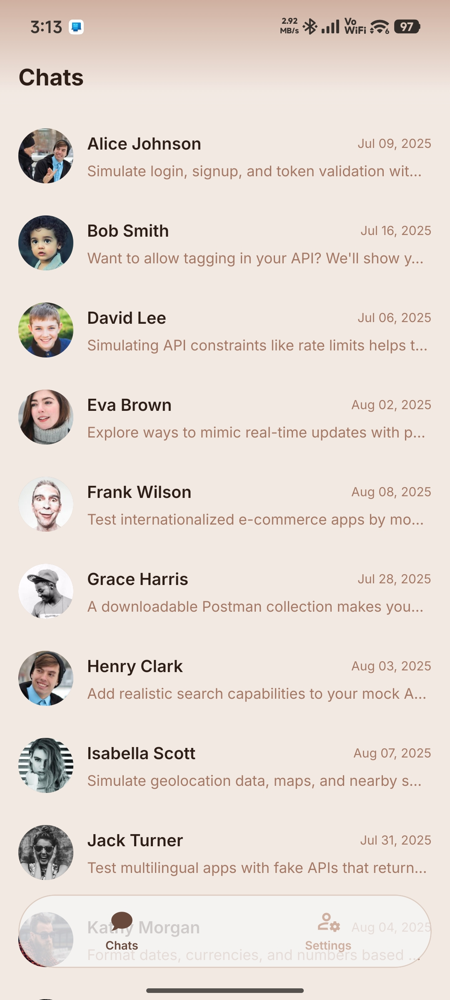
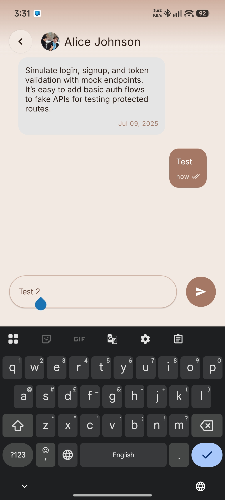
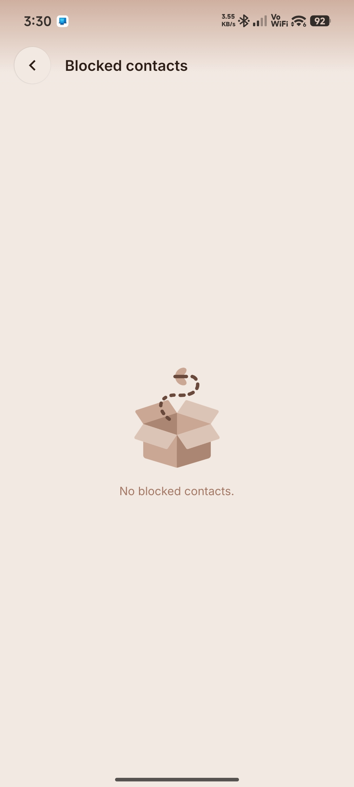
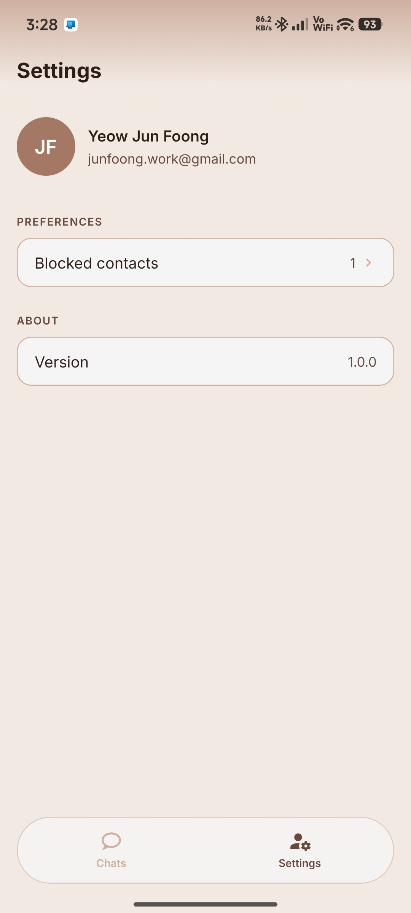
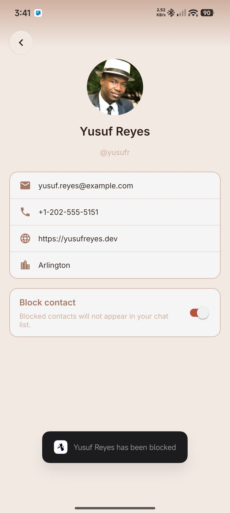
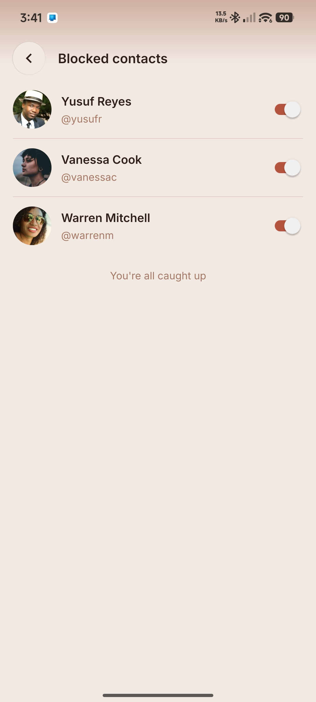

# Chat App

A React Native chat app built as a take-home assessment for a mobile developer role at **Respond.io**. It's a portfolio piece against a mock REST API, not a production app — the goal was to demonstrate TanStack Query usage, state boundaries, and RN architecture, not to build a complete messaging product.

Feature-first, not type-first:

```
src/
  api/            axios instance + raw endpoint calls, no React (client.js, index.js)
  features/
    chats/        contacts list (infinite query, preview index, chat row)
    chat/         conversation screen (messages query, optimistic send, composer)
    profile/      contact profile screen
    settings/     settings + blocked-contacts list
  store/          blockStore.js — the one piece of client state
  navigation/      stack + tab navigators, floating tab bar, header scrim
  ui/             Text, Icon, List (loading/empty/error + FlashList wrapper), Skeleton
  lib/            mappers (raw API shape -> domain shape), time formatting, query client
  theme/          design tokens
```

`api/` is shared rather than colocated per feature because the endpoints are resource-shaped (`/api/users`, `/api/posts`) while the screens are feature-shaped, and they don't line up — Chats and Profile both read `/api/users`. Feature folders own everything that *does* belong to one screen: the hooks, query `select` logic, optimistic mutation logic. Raw API shapes never reach a component — `api/` returns raw JSON, `lib/mappers.js` converts to domain shapes, hooks return domain shapes.

### State boundaries

- **TanStack Query owns all server state** — contacts, messages, profiles. It's a cache, not a store.
- **Zustand owns exactly one piece of client state**: the set of blocked contact IDs, persisted with `expo-sqlite/kv-store` via Zustand's `persist` middleware (`src/store/blockStore.js`). Nothing fetched from the API is ever copied into it.
- Local UI state (composer text, switches) stays in `useState` in the component that owns it.

## Screenshots

| Chats | Conversation | Empty state |
| --- | --- | --- |
|  |  |  |
| **Settings** | **Block contact** | **Unblock contact** |
|  |  |  |

## AI tooling

[Claude Code](https://claude.com/claude-code) was used as a collaborator during the design phase, brainstorming the architecture, state boundaries, and the optimistic-send flow together before any implementation started. It was also used afterward to review the code that was written, rather than to write it unsupervised.

---

Expo (managed, SDK 57) · React Navigation v7 · TanStack Query v5 · Zustand · FlashList v2 · `expo-image` · `react-native-keyboard-controller` · Reanimated v4 · `axios`. Android only — the APK is the deliverable, there's no iOS build.
